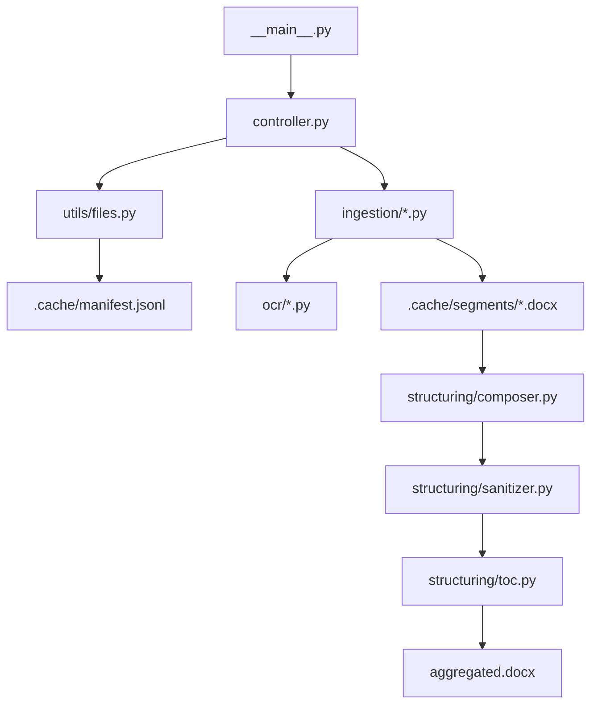

# doc-aggregator

`doc-aggregator` scans a directory, extracts content from mixed document types, and produces a single structured `.docx` output with filename-based sections and a table of contents.

## Features

- Supports `.txt`, `.docx`, `.pdf`, `.jpg`, `.jpeg`, `.png`, `.tiff`, `.tif`
- Uses PyMuPDF text extraction first, OCR fallback for low/no-text PDF pages
- OCR preprocessing pipeline (grayscale, denoise, deskew) with OpenCV
- Tesseract language hinting with safe fallback behavior
- Output is resumable using an append-only manifest cache
- Final output sanitizes external relationships by default

## Environment setup

```bash
conda env create -f environment.yml
conda activate doc-aggregator
```

In Cursor, the interpreter is configured via `.vscode/settings.json`:

- `/opt/miniconda3/envs/doc-aggregator/bin/python`

## Usage

From the directory containing your source files:

```bash
doc-aggregator .
```

This creates a timestamped output folder like:

```text
_doc_aggregator_output_2026-02-18_1430/
  aggregated.docx
  processing.log
  .cache/
    manifest.jsonl
    segments/
```

### Common options

```bash
doc-aggregator . --dry-run
doc-aggregator . --resume
doc-aggregator . --open
doc-aggregator . --ocr-dpi 300
doc-aggregator . --max-file-size-mb 200
doc-aggregator /path/to/input --output-dir /tmp/out --output-name report.docx
```

## Architecture



## Security and robustness notes

- Output directories matching `_doc_aggregator_output*` are automatically excluded from scanning.
- Symlink following is disabled by default.
- File count, size, recursion depth, OCR page timeout, and pixel count are bounded by config.
- TOCTOU checks verify a file did not change between scan and processing.
- External relationships are stripped from the final `.docx` unless `--no-strip-external` is used.
- Logs contain processing metadata and errors, not full extracted text payloads.
