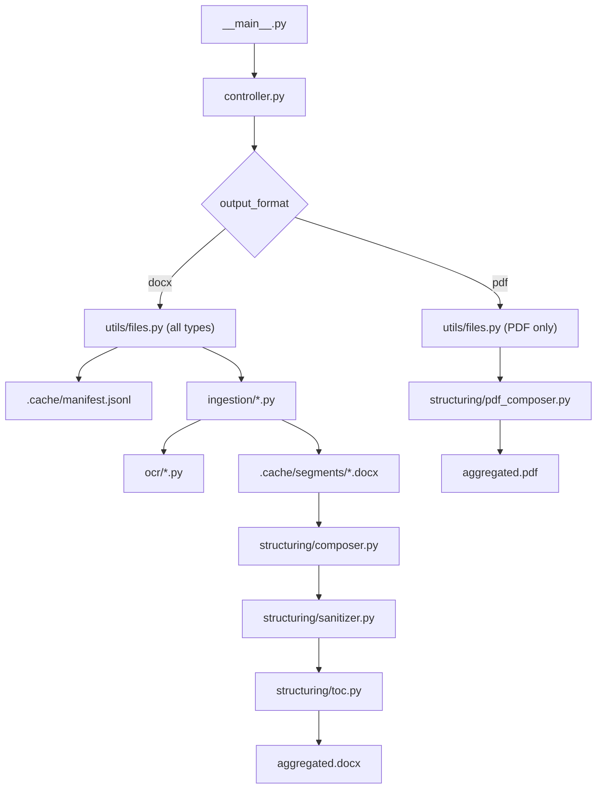

# doc-aggregator

`doc-aggregator` scans a directory, extracts content from mixed document types, and produces a single structured output file with filename-based sections and a table of contents.

## Features

- **Two output modes**: DOCX (default) for mixed-format extraction, or PDF for lossless native merging
- Supports `.txt`, `.docx`, `.pdf`, `.jpg`, `.jpeg`, `.png`, `.tiff`, `.tif` in DOCX mode
- Native PDF merge via `--pdf` preserves original page fidelity, annotations, and layout
- PyMuPDF text extraction with OCR fallback for low/no-text PDF pages (DOCX mode)
- OCR preprocessing pipeline (grayscale, denoise, deskew) with OpenCV
- Tesseract language hinting with safe fallback behavior
- DOCX output is resumable using an append-only manifest cache
- Final DOCX output sanitizes external relationships by default

## Environment setup

```bash
conda env create -f environment.yml
conda activate doc-aggregator
```

In Cursor, the interpreter is configured via `.vscode/settings.json`:

- `/opt/miniconda3/envs/doc-aggregator/bin/python`

## Usage

### DOCX mode (default)

Extracts and converts all supported file types into a single structured `.docx` with headings, section breaks, and a clickable table of contents.

```bash
doc-aggregator .
```

This creates a timestamped output folder like:

```text
_doc_aggregator_output_2026-02-18_1430/
  aggregated.docx
  processing.log
  .cache/
    manifest.jsonl
    segments/
```

### PDF mode

Merges PDF files natively with zero conversion loss. Pages are copied at the document-object level, preserving fonts, vector graphics, annotations, and layout exactly as they are. Each source file gets a bookmark entry in the final PDF.

```bash
doc-aggregator --pdf .
```

To write the merged PDF back into the source folder:

```bash
doc-aggregator --pdf "/path/to/pdfs" -o "/path/to/pdfs" -n "combined.pdf"
```

PDF mode produces only the output file -- no `.cache`, no `manifest.jsonl`, no `processing.log`. The generated output is automatically excluded from scanning on reruns, so running the same command twice produces an identical result.

### Common options

```bash
doc-aggregator . --dry-run              # preview discovered files
doc-aggregator . --resume               # resume interrupted DOCX run
doc-aggregator . --open                 # open output after completion
doc-aggregator . --ocr-dpi 300          # set OCR resolution (DOCX mode)
doc-aggregator . --max-file-size-mb 200 # cap per-file size
doc-aggregator /path/to/input -o /tmp/out -n report.docx
doc-aggregator --pdf /path/to/pdfs -o /tmp/out -n merged.pdf
```

## Architecture



## Security and robustness notes

- Output directories matching `_doc_aggregator_output*` are automatically excluded from scanning.
- In PDF mode, the configured output file and its atomic-write temp file are excluded from scanning, preventing self-inclusion on reruns.
- Corrupted or encrypted PDFs are skipped with a warning; valid files still merge successfully.
- Symlink following is disabled by default.
- File count, size, recursion depth, OCR page timeout, and pixel count are bounded by config.
- TOCTOU checks verify a file did not change between scan and processing.
- External relationships are stripped from the final `.docx` unless `--no-strip-external` is used.
- Atomic writes prevent partial output on crash or interruption in both modes.
- Logs contain processing metadata and errors, not full extracted text payloads.
